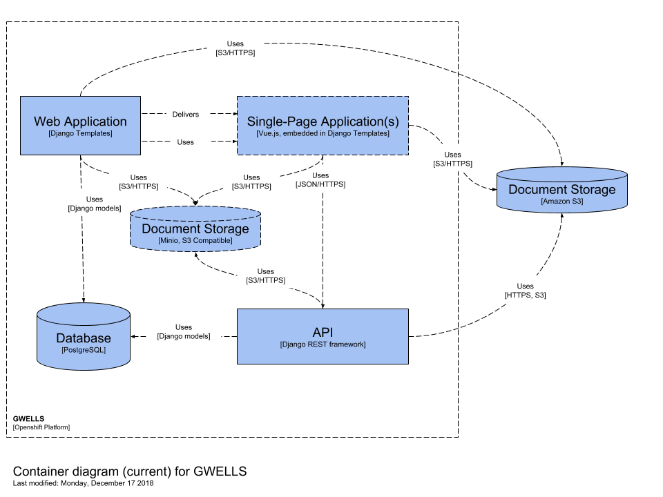

[](https://github.com/bcgov/repomountie/blob/master/doc/lifecycle-badges.md)

# Groundwater Wells and Aquifers (GWELLS)

https://apps.nrs.gov.bc.ca/gwells/

## Introduction

The Ministry of Environment receives and processes groundwater data and information related to the construction, alteration and decommissioning of groundwater wells. Well construction and reporting requirements are regulated under the Water Sustainability Act and Groundwater Protection Regulation. The information collected and stored is used by government and other users to help inform decisions related to the management of the groundwater resource in B.C.

GWELLS, the new groundwater data repository, aims to improve the user experience when submitting and searching for well information, to improve the quality of the data being submitted, and to improve the overall functionality of the system to meet user and regulatory requirements.

The application is being developed as an open source solution.

## Table of Contents

1. [Using the GWELLS API](#Using-the-gwells-api)
1. [DataBC Export](#databc-export)
1. [Developing GWELLS](#Developing-gwells)
   - [Setup Prerequisites](#setup-prerequisites)
   - [Running the GWELLS application locally](#Running-the-GWELLS-application-locally)
   - [Authentication](#Authentication)
   - [Running tests](#Running-tests)
   - [Making pull requests](#Making-pull-requests)
1. [Architecture](#Architecture)
1. [Contributing](#contributing)
   - [Code With Us](#code-with-us)
1. [License](#license)

## Using the GWELLS API

GWELLS maintains a REST API where public data relating to wells is made available for other applications and services.

Our Swagger documentation is available at https://apps.nrs.gov.bc.ca/gwells/api/. Some examples of GWELLS endpoints:

Wells:

```sh
# all wells (paginated)
curl https://apps.nrs.gov.bc.ca/gwells/api/v1/wells

# all wells in an area bounded by sw_lat, sw_long, ne_lat, and ne_long
curl https://apps.nrs.gov.bc.ca/gwells/api/v1/wells?sw_lat=51.599253&sw_long=-128.220340&ne_lat=52.108192&ne_long=-127.150547
```

Aquifers:

```sh
# all aquifers
curl https://apps.nrs.gov.bc.ca/gwells/api/v1/aquifers
```

See the [Swagger documentation](https://apps.nrs.gov.bc.ca/gwells/api/) for more examples.

## DataBC Export

GWELLS Api is used by DataBC to export model information and provide well information on the DataBC website.

The command located in app/backend/gwells/management/commands/export_databc.py is used to pull data from the gwells database and export it for consumption in DataBC.

If a new field(s) are needed for export, this export_databc.py has raw sql queries that need to be updated with the required fields. Descriptions are also needed for the swagger documentation that are pulled from the db_comment fields in the django models. Both the raw sql queries and the db_comment field on the model need to be updated for new fields.

## Developing GWELLS

### Setup Prerequisites

**Software Requirements**

- Docker Desktop
- Node

**Actions to take**:

- [Connecting to Minio](#connecting-to-minio)
- [CSSO Authentication](#authentication)
- You will need to login to [artifactory](https://artifacts.developer.gov.bc.ca/ui/login/) with your IDIR so a member of Sustainment Team can add you.

### Connecting to Minio

For gwells to interact with your local instance of Min.IO add the appropriate settings to your local machines `HOSTS` file:

```
127.0.0.1 minio-public
127.0.0.1 minio-private
```

### Authentication

Some GWELLS pages (submitting new well reports, adding or editing aquifers, or adding or editing qualified well drillers to the registry) require authentication. Authentication uses the Province's Single Sign-On system. A GWELLS team member can request access for collaborators if needed.

### Running the GWELLS application locally

- [Clone the GWELLS repository](https://help.github.com/en/articles/cloning-a-repository)
- From the gwells folder run `docker-compose up -d`

Login to Artifactory for pulling the backend base image:

```sh
docker login -u <svc-usn> -p <svc-pwd> artifacts.developer.gov.bc.ca/g26e-backend-docker-local
```

Replace svc-usn and svc-pwd with Artifactory service account credentials obtained from Openshift (under artifacts-default-tulivf secrets)

Then, run the application with Docker:

```sh
cd gwells
docker-compose up
```

### Running GWELLS locally with a connection to Staging's Database

To have a more complete dataset while running locally, you can opt to point the backend at GWELLS' staging database **while using the BC Government VPN**. This will provide a more robust dataset for debugging or feature testing.

1. Duplicate `.env.template` and rename the new file as `.env.test`

2. Using the database secrets from GWELLS' staging namespace on OpenShift, replace the variables in your new `.env.test` file. You'll need to change `ENVIRONMENT` to 'test' as well to ensure the proper `command` is run from the `app/scripts/backend-command-script.sh` file.

    Note: to get the `GWELLS_SERVICE_HOST` and `GWELLS_SERVICE_PORT`, use the `oc` CLI and login to GWELLS' test namespace; run the following command to view the `TransportServer` for the staging database:

    ```
    oc project 26e83e-test

    oc -n 26e83e-test get ts
    ```

    This should print out a `VIRTUALSERVERADDRESS` (the `GWELLS_SERVICE_HOST`) and a `VIRTUALSERVERPORT` (the `GWELLS_SERVICE_PORT`)

    ```
    NAME              VIRTUALSERVERADDRESS   VIRTUALSERVERPORT   POOL          POOLPORT   IPAMLABEL   IPAMVSADDRESS   STATUS   AGE
    yourservice-tsc   142.34.194.68          65555               yourservice   8000                   None            Ok       21d
    ```

    Your `.env.test` file should look something like this:

    ```
    # .env for test environment
    ENVIRONMENT=test
    API_TARGET=http://backend:8000/
    DATABASE_USER=<db-user>
    DATABASE_PASSWORD=<db-password>
    GWELLS_SERVICE_HOST=142.34.194.68
    GWELLS_SERVICE_PORT=<port-number>
    ```

3. Once `.env.test` has the proper environment variables, run the `docker-compose up` command with the `--env-file` flag:

    ```
    docker-compose --env-file ./.env.test up
    ```

You should now have a local build with a backend that points to staging's database. **Be mindful when saving or changing data to the staging database**.

If you're encountering any issues with the build, ensure that your VPN is connected and working properly.

>Minio doesn't download while connected using the VPN. This is a known issue.

### Running GWELLS in Debug Mode

Ensure you have a `launch.json` file in the `.vscode` directory.

```json
{
  "version": "0.2.0",
  "configurations": [
    {
      "name": "Remote Django App",
      "type": "python",
      "request": "attach",
      "pathMappings": [
        {
          "localRoot": "${workspaceFolder}/app/backend",
          "remoteRoot": "/app/backend"
        }
      ],
      "port": 3000,
      "host": "localhost"
    }
  ]
}
```

In VS Code, press `F5` or go to **Run > Start Debugging** to run in debug mode.

You can now add breakpoints within GWELLS - [more information about debugging in VS Code here.](https://code.visualstudio.com/docs/editor/debugging)

### Connecting to PGAdmin

> Information in this section reflects docker-compose as of `Nov 8th, 2023`

PG Admin is setup in the `docker-compose up` and requires no additional installations

Steps:

1. Connect to Pgadmin through [localhost](http://localhost:5050)
1. Login using username: `admin@gwells.com`, password: `admin`
1. Right click `Server` -> `Register` -> `Server`
1. Enter any meaningful name in `Name`
1. Under the `Connection` tab supply the following values

| Field               | Value    |
| ------------------- | -------- |
| Host name / address | `db`     |
| Port                | `5432`   |
| Username            | `gwells` |
| Password            | `test1`  |

Visit the following links to browse the API and frontend applications:

- Django REST API development server: http://localhost:8000/gwells/api/
- Vue frontend development server: http://localhost:8080/

### Running tests:

For comprehensive testing information visit the [Wiki](https://github.com/bcgov/gwells/wiki/Testing)
Postman API tests:
Import the json test collections in the `api-tests/` folder into [Postman](https://www.getpostman.com/).

### Import a Shapefile

Single shapefile, with aquifer ID specified in CLI.

```
docker-compose exec backend python manage.py import_shapefile 2 aquifers/fixtures/shp/shapefile.zip
```

Bulk import, requires the AQ_NUMBER attribute on each polygon. Requires a folder with shapefiles to be prepared and passed in (zipped or not). Note: if DEBUG=True, all geometries will be uploaded to a random aquifer instead of the one matching its' number, so we can test locally with a development database.

```
mkdir app/backend/bulk
mv DATABC_EXPORT_FILE.zip app/backend/bulk/

docker-compose exec backend python manage.py import_bulk_shapefile bulk
```

### Importing Licences

To download new licence data from DataBC and merge it into your DB, do

```
docker-compose exec backend python manage.py import_licences
```

### Making pull requests

Pull requests made from branches in the bcgov/gwells repo will kick off a dev pipeline, which runs tests and deploys a preview environment containing your changes. The pull request page will update when the environment is deployed and mandatory checks (unit tests, etc.) pass or fail.

## Architecture

GWELLS uses PostgreSQL (with PostGIS), Django REST Framework, and Vue.js. We also use both AWS S3 and a self-hosted Minio service for storing documents.

Our production and staging environments run on an OpenShift container platform cluster. OpenShift templates for services are located in the `openshift/` folder, along with more information about dev and staging environments on our cluster.



## Contributing

Government employees, the public and members of the private sector are encouraged to contribute. Please read and follow our [Code of Conduct](https://github.com/bcgov/gwells/blob/master/CODE_OF_CONDUCT.md).

All contributors retain original copyright, but are granting a world-wide, royalty-free, perpetual, irrevocable, non-exclusive, transferable license to all users. This project is covered by an [Apache v2.0 license](https://github.com/bcgov/gwells/blob/master/LICENSE).

### Code With Us

Many of our features have been developed by members of the community. Check the [BC Developer Exchange website](https://bcdevexchange.org/), where paid opportunities to build features for GWELLS and other applications are posted.

## License

Code released under the [Apache License, Version 2.0](https://github.com/bcgov/gwells/blob/master/LICENSE).

## Additional Documentation

More documentation for the repository can be found in the following places

- [Frontend](/app/frontend/README.md)
- [OpenShift](/openshift/README.md)
- [Tests](/tests/api-tests/README.md)
